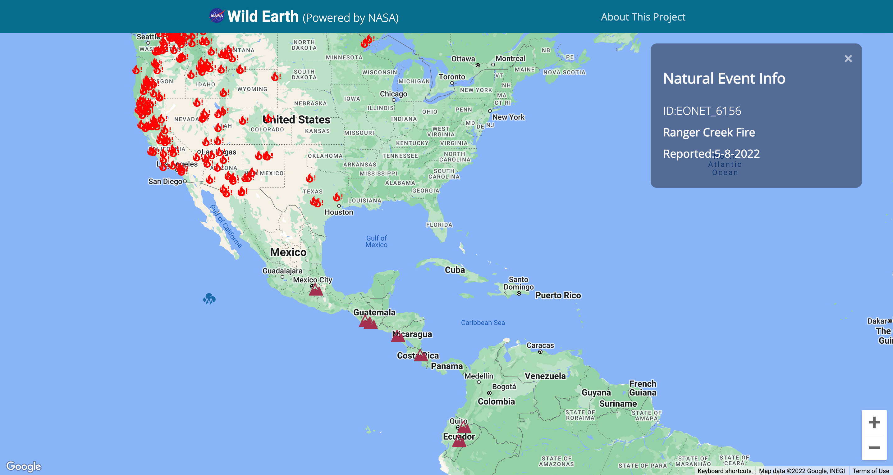

## Wild Earth

This is a project to track natural events happening on earth right now by using a NASA's API The Earth Observatory Natural Event Tracker (EONET).

### Screenshot

### Links

- Live Site URL: [https://wild-earth-ushisha.netlify.app/](https://wild-earth-ushisha.netlify.app/)

## My process

### Built with

- [React](https://reactjs.org/) -JS library
- [NASA API](https://api.nasa.gov/)
- [Google Map React](https://www.npmjs.com/package/google-map-react) - React component written over Google Maps API
- [@iconify/react](https://www.npmjs.com/package/@iconify/react) - React icon component

### Acknowledgement

<a target="_blank" href="https://icons8.com/icon/63673/nasa">Nasa</a> icon by <a target="_blank" href="https://icons8.com">Icons8</a>
